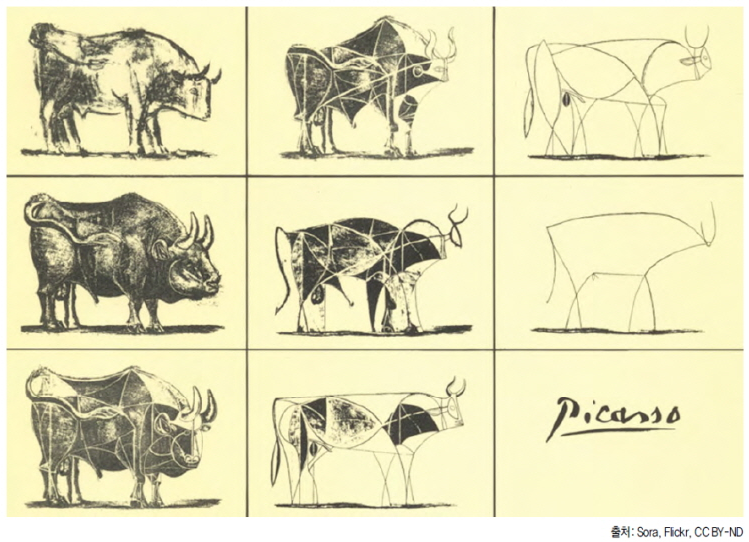

# 다른 사람이 보았을 때 이해하기 쉬워야 한다.

## 클린코드

## 템플릿, 프레임워크
MVC에 너무 매몰되지 말도록 하자. 정말 전체적으로 간결한가?<br>
한개의 파일로 할것을 여러개로 쪼개서 좋다고 하는것은 아닌가? 생각해 보라는 것이다.

### 템플릿
PHP 자체가 템플릿이다. 별도의 템플릿이 필요 없다는 의미이다.

### 프레임워크
PHP 창시자는 프레임워크를 사용하지 말라고 한다. 왜? 그럴까 생각해볼 필요는 있는 것이다.

## 피카소의 황소
핵심을 이해하고 간결하고 이해하기 쉽게 만드는 것이 좋다.  
<span style="color:blue">**즉, 쉬운것을 어렵게 하지 말자는 것이다.**</span>
  - 객체지향이 절차지향의 위에 있는것이 아니다. 서로 장단점을 가지고 있으며 보완을 하면 더 좋다
  - 피카소는 본래의 황소도 잘그린다. 기본에 충실해야 핵심을 잘 파악 할 수 있는 것이다.

<br>

예를 들면 다음과 같다.
  - 상속을 너무 많이 하게 되면 디버깅 할 때 부모 찾아 삼만리가 된다.  
    (일부 중복이 나쁜것은 아니다.)
  - 코드 재사용은 분명 좋은것이다. 하지만 너무 이부분에 몰입하면 더 복잡해 진다.  
    너무 많은 함수 메소드를 만드는 것은 분명 후회하게 된다.(남을 힘들게 한다)  
    (이해하기 쉽고 간결하고 수정하기 쉬운것이 더 좋다) 
  - DB 설계할때 시스템 현황에 맞지 않게 너무 많은 정규화는 오히려 더 많은 시간을 필요 하게 된다.  
    (역정규화는 속도를 더 빠르게 하기 위해 사용 되기도 한다.)    

  
**✔프로그래머의 오래된 유머가 있는데 다음과 같은 것이다.**
```
문제) 화면에 hello를 출력 하시오.

🤦‍♂️ JAVA
public class HelloWorld {
  public static void main(String[] args) {
    System.out.println("hello");
  }
}

🤦‍♂️ C
int main() {
  printf("hello");
}

🤦‍♂️ NodeJS(JavaScript)
console.log("hello");

🤦‍♂️ PHP 
echo 'hello';

👌 전문가, 해커
리눅스 쉘에서 echo hello
```

## 보안
기본적인 시큐어 코딩은 반드시 익혀야 한다. 내가 경력이 아무리 많아도 분기에 한번정도는 찾아서 새로운 것은 없는지 확인하는 습관을가지는 것이 좋다.