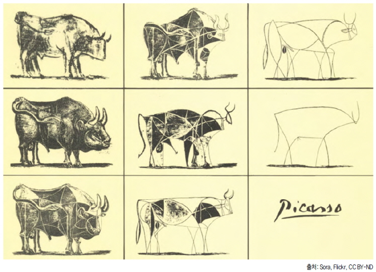

## 피카소의 황소
이곳에 들어오신 김에 혹시 이미지에 대해 모르면 하나 알고 갑시다.
- PNG는 이미지 깨짐이 없다. 비손실 압축(파일 크기는 JPG 보다 일반적으로 크다)
- JPG 손실압축 방식을 사용한다.(퀄리티는 단계별로 등급이 다르다)
- BMP 비트맵 이미지는 화소 하나하나의 원본을 가지고 있어 용량은 클 수 밖에 없다.
 

 

✨ 아래는 GPT-4 달리가 만든 피카소의 황소이다. 

 
[황소1] 

[황소2] 
 
